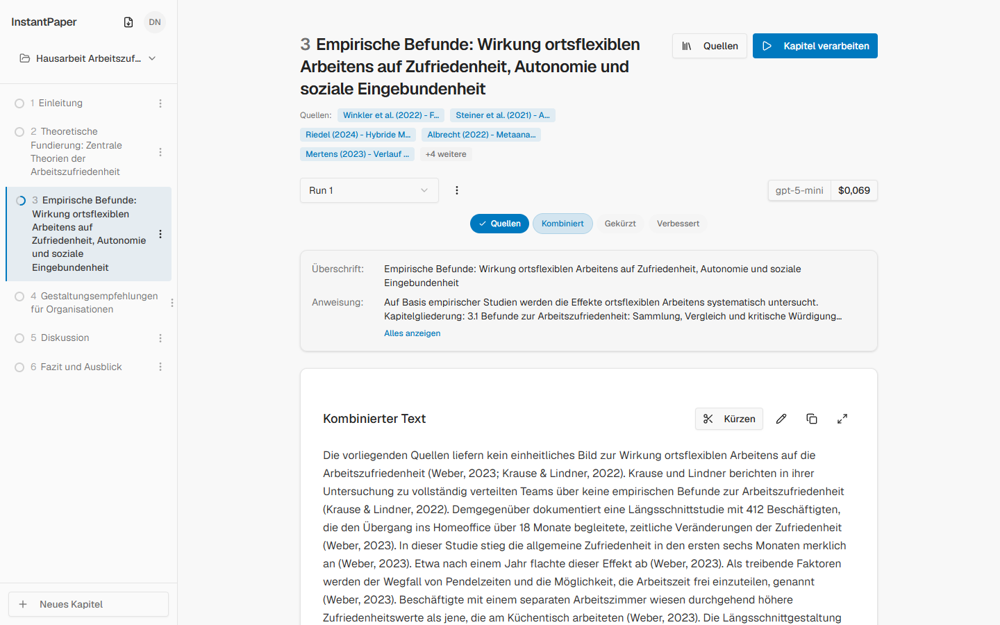
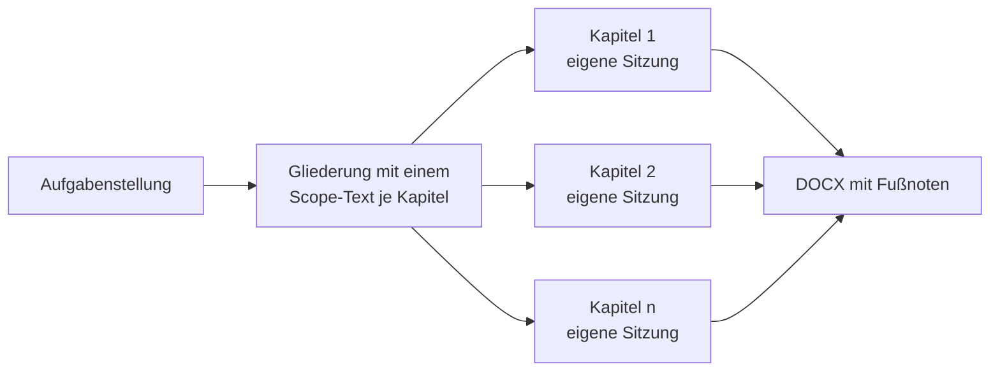
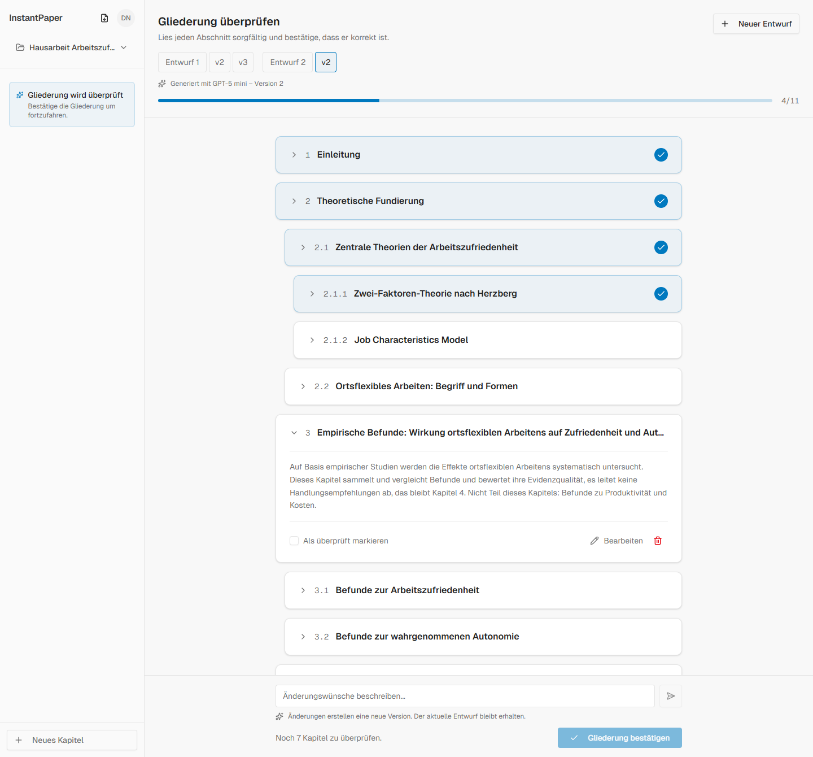
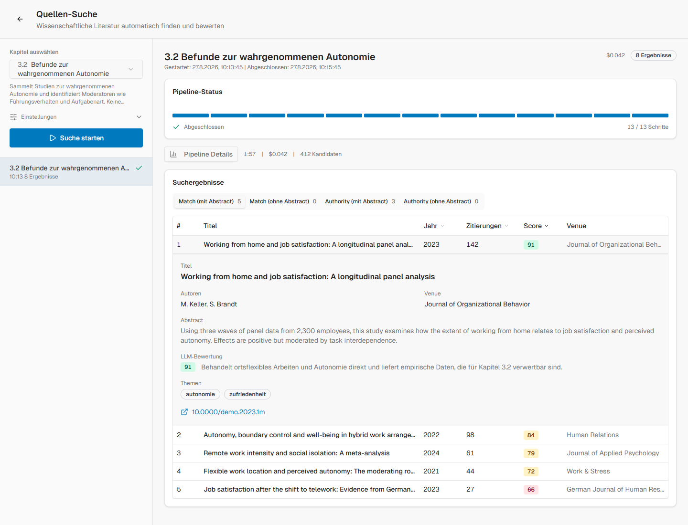
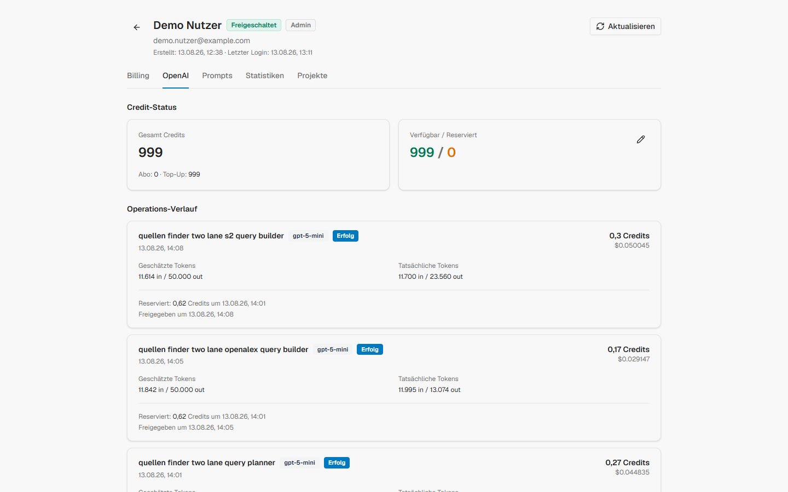

# Case Study: instantpaper

_Stand August 2026. Alle Screenshots stammen aus der echten, lokal laufenden Oberfläche mit einem Beispielprojekt, Quellen und Paper darin sind erfunden._

---

**Was:** Ein Schreibwerkzeug für wissenschaftliche Arbeiten. Aus einer Aufgabenstellung entsteht eine Gliederung, zu jedem Kapitel werden Quellen gesammelt, verarbeitet und zu belegten Textabschnitten verbunden, und jeder Zwischenstand wird vom Nutzer gelesen und einzeln bestätigt.
**Status:** Eingestellt. Gebaut von Dezember 2025 bis Mai 2026 als eigenes Produkt mit dem Ziel, es zu verkaufen. Vollständig fertig inklusive Abrechnung, Staging- und Produktionsumgebung, nie vermarktet, keine zahlenden Nutzer, heute nicht mehr deployt.
**Stack:** Next.js auf Vercel, FastAPI auf Cloud Run, Cloud Run Jobs mit CPU- und GPU-Pfad für die schwere Arbeit, Firebase für Anmeldung, Daten und Storage, Stripe für die Abrechnung, Anthropic und OpenAI hinter einem gemeinsamen Router.
**Code:** github.com/mrlmueller/instantpaper-demo

## Das Problem

Mehrere Freunde von mir mussten für ihr Studium wissenschaftliche Arbeiten schreiben und taten sich schwer damit, vor allem mit der Frage, womit man überhaupt anfängt. Gemeint ist dabei eine bestimmte Art von Arbeit: eine Hausarbeit oder Seminararbeit, die auf einer Aufgabenstellung beruht und mit Hilfe von Quellen beantwortet wird. Wer selbst forschen muss, also Daten erhebt und auswertet, hat ein anderes Problem, und dafür ist das Werkzeug nicht gedacht.

Bei einer solchen Literaturarbeit ist der größte Teil Quellenarbeit: PDFs sichten, relevante Stellen finden, Aussagen zuordnen, Belege behalten. Der fertige Absatz am Ende ist der kleinste Teil. Ich hatte selbst etwas Erfahrung mit solchen Arbeiten und habe mir überlegt, wie ein Workflow aussehen müsste, der diese Arbeit so weit wie möglich automatisiert oder wenigstens vereinfacht. Eine Sache war dabei von Anfang an klar: Ohne akribisches Prüfen und Verifizieren dessen, was die KI liefert, geht es nicht. Das Ergebnis wird sonst schlicht schlecht, weil eine wissenschaftliche Arbeit von belegten und nachvollziehbaren Aussagen lebt. Die App ist deshalb so gebaut, dass sie den Nutzer an jeder Stelle zum Lesen und Bestätigen einlädt und an den entscheidenden Stellen, etwa bei der Gliederung, auch dazu zwingt.

Der Auslöser, daraus ein Produkt zu machen, war derselbe wie die Idee: Ich baue etwas, das meine Freunde brauchen können, und wenn es bei ihnen gut ankommt, lässt es sich möglicherweise auch verkaufen.

| Phase            | Zeitraum              | Woran gearbeitet wurde                                                   |
| ---------------- | --------------------- | ------------------------------------------------------------------------ |
| Kern             | Dezember 2025         | Gliederung, Quellen-Manager, Kapitel-Pipeline, DOCX-Export               |
| Betrieb          | Januar 2026           | Guthaben, Kostenerfassung, Admin-Bereich, erste Auswertungs-Datensätze   |
| Quellen-Finder   | Februar bis März 2026 | erste Fassung, dann kompletter Neubau als Two-Lane-Suche                 |
| PDF-Scan         | März 2026             | Benchmark-Aufbau, Audit, Neuausrichtung, Aufteilung in CPU- und GPU-Jobs |
| Zweiter Anbieter | April 2026            | Claude-Integration über einen gemeinsamen Router                         |
| Ende             | Mai 2026              | letzter Commit, danach eingestellt                                       |

## Die Kernidee: die Gliederung als Kontextanker

Das eigentliche Problem beim Schreiben mit einem Sprachmodell ist eine Grenze des Werkzeugs. Eine wissenschaftliche Arbeit ist so umfangreich und so verzweigt, dass kein Modell ihren gesamten Kontext zuverlässig so im Blick behalten kann, dass am Ende etwas Sinnvolles herauskommt. Die Arbeit entsteht deshalb zwangsläufig über viele einzelne Sitzungen, und jede davon sieht nur einen Ausschnitt. Ich brauchte also etwas, das für die gesamte Arbeit gleich bleibt und trotzdem jede einzelne Sitzung führt. Das ist die Gliederung.

Die Idee: Beim Erstellen der Gliederung entsteht zu jedem Kapitel ein kurzer Text, der eingrenzt, worum es in diesem Kapitel geht und worum nicht. Jede spätere Sitzung arbeitet dann allein mit diesem Kapitel und seinem Text, ohne den Rest der Arbeit kennen zu müssen. Der Kontext einer Sitzung schrumpft damit auf ein Kapitel, und selbst innerhalb eines Kapitels lässt sich die Arbeit auf mehrere Sitzungen verteilen, weil der Kapiteltext als fester Bezugspunkt in jeder davon gleich bleibt.

Das klingt einfach. Es war aber das Ergebnis von sehr viel Herumprobieren und nicht die erste Idee, sondern die erste, die funktioniert hat. Schwierig war die Balance in den Kapiteltexten. Sie müssen eng genug eingrenzen, was hinein gehört und was nicht, dürfen aber das Ergebnis nicht vorwegnehmen. Eine wissenschaftliche Arbeit soll vorhandene Informationen neu verknüpfen, und wer vorher schon festlegt, was dabei herauskommt, bekommt keine Arbeit, sondern eine Bestätigung. Über viele Iterationen ist daraus ein Prompt geworden, der die Gliederung und die zugehörigen Kapiteltexte halbwegs zuverlässig erstellt. Halbwegs heißt: Er ist immer inkonsistent geblieben. Eine Gliederung ist nie mit einem einzigen Aufruf fertig, sondern wird auf dem ersten Entwurf per Anweisung verfeinert, und jede Verfeinerung wird eine neue Version in einem Versionsbaum.

Genau deshalb sieht die Oberfläche so aus, wie sie aussieht. Übernommen wird die Gliederung erst, wenn jeder einzelne Punkt gelesen und als geprüft abgehakt ist. Solange auch nur ein Kapitel unbestätigt bleibt, ist der Knopf gesperrt. Das ist keine Bevormundung, sondern die Konsequenz aus der Kernidee: Jeder Fehler, der an dieser Stelle in die Gliederung kommt, zieht sich durch die gesamte Arbeit. Dieser Prompt war immer die größte Schwachstelle der App.

_Zwei Entwürfe, auf denen jeweils in Versionen iteriert wurde, Gliederungspunkte über drei Ebenen, und der Fortschritt beim Bestätigen. Beispielprojekt in der lokal laufenden App._

## Vom Quellentext zum Kapitel

Das Herz der App ist die Verarbeitung, mit der aus vielen einzelnen Quellen ein zusammenhängender Kapiteltext wird. Bevor sie sich erklären lässt, ein Begriff: Eine Quelle ist in instantpaper ein Textdokument mit Zitatangabe. Der Text ist genau der Ausschnitt, den der Nutzer selbst gelesen und für relevant befunden hat, die Zitatangabe ist die Literaturangabe dazu. Quellen liegen im Quellen-Manager, werden einem oder mehreren Kapiteln zugeordnet, und wie eine Quelle später im Text zitiert wird, ist je Quelle einstellbar. Eine Quelle kommt also nie ungelesen ins System.

Aus diesen Quellen entsteht ein Kapitel in vier Stufen, und bei jeder Stufe ging es um dieselbe Frage: Wie bekommt das Modell genug Kontext, um gut zu arbeiten, ohne dass der Kontext so groß wird, dass Qualität verloren geht?

**Verarbeiten.** Jede Quelle wird einzeln verarbeitet. Das Modell bekommt das Kapitelthema, also den Scope-Text aus der Gliederung, dazu den Quellentext und das fertige Kurzzitat, und schreibt daraus einen belegten Abschnitt. Gibt die Quelle für dieses Kapitel nichts her, meldet der Lauf genau das, statt etwas zu erfinden. Weil jede Quelle ihre eigene Anfrage bekommt, bleibt der Kontext klein, und keine Quelle geht zwischen den anderen unter. So hat am ende jedes Kapitel je nach dem so um die 4 bis 10 Texte.

**Kombinieren.** Die einzelnen Abschnitte werden zu einem Kapiteltext zusammengeführt. Bei mehr als fünf Texten passiert das nicht in einem Schritt, sondern hierarchisch in Gruppen, damit keine einzelne Anfrage zu viele Texte auf einmal tragen muss. Die Vorgabe an das Modell ist dabei, alle Informationen und alle Belege zu übernehmen und nur die Reihenfolge und die Übergänge zu gestalten.

**Kürzen.** Der kombinierte Text wird gestrafft und von Dopplungen befreit, und zwar nicht nur innerhalb des Kapitels, sondern gegen die anderen Kapitel der Arbeit. Damit das im Kontext Platz hat, bekommt das Modell die anderen Kapitel nicht in voller Länge, sondern als Zusammenfassungen, die einmal berechnet und zwischengespeichert werden, solange sich das zugrunde liegende Kapitel nicht ändert. So sieht das Modell die ganze Arbeit im Überblick und das aktuelle Kapitel im Detail.

**Lesefluss.** Zuletzt wird das Kapitel in einen fließenden Text gebracht, der einen roten Faden durch die Arbeit legt. Das Modell bekommt dafür die Aufgabenstellung und wieder die zusammengefasste Gesamtarbeit, damit es auf bereits behandelte Inhalte verweisen kann und am Ende des Kapitels in das nächste überleitet. Die Vorgabe lautet auch hier, nichts zu ergänzen und nichts wegzulassen, sondern nur zu verbinden.

Jede dieser Stufen bleibt ein Entwurf mit Versionshistorie, den der Nutzer liest und per Chat-Anweisung überarbeiten lässt oder direkt von Hand umschreibt. Nichts davon ist als fertig gedacht, bevor es nicht gegengelesen wurde. Am Ende werden die Kapitel als DOCX exportiert.

## Aufbau in fünf Monaten

Der Kern der App stand im Dezember 2025, mit 172 Commits im ersten Monat. Schon am zweiten Tag entstand die Kapitel-Pipeline aus dem vorigen Kapitel, in derselben Woche der Quellen-Manager. Im Januar kam der Betriebsteil dazu: Guthaben, Kostenerfassung, der Admin-Bereich, und die ersten Auswertungs-Datensätze, mit denen sich Ergebnisse überhaupt vergleichen ließen. Ab Februar ging die Arbeit in die beiden Werkzeuge zur Quellensuche, die den größten Teil der restlichen Zeit gekostet haben.

Gebaut habe ich instantpaper mit Coding-Agenten, und die Werkzeuge haben sich unterwegs verschoben: am Anfang noch viel ChatGPT im Browser, dann OpenAI Codex, am Ende hauptsächlich Claude Code. Der Entwurf und die Entscheidungen sind meine, den Code hat die KI geschrieben.

## Der Quellen-Finder: zweimal gebaut

Der Quellen-Finder sucht wissenschaftliche Literatur über die offenen Datenbanken OpenAlex und Semantic Scholar. Die erste Fassung vom Februar sah vielversprechend aus, war im echten Einsatz aber unbrauchbar. Sie lieferte Quellen, die auf den ersten Blick zum Thema passten, bei näherem Hinsehen taugte keine davon für die Arbeit. Das war die schwerste Stelle des ganzen Projekts, und sie hat leider nie perfekt funktioniert.

Anfang März habe ich den Finder nach einem eigenen Umsetzungsplan komplett neu gebaut, als Pipeline mit 13 Schritten, deren Fortschritt und Kosten sich live in der Oberfläche verfolgen ließen. Ein Planungs-Modell zerlegt das Kapitelthema zuerst in inhaltliche Facetten und baut daraus Suchanfragen in mehreren Varianten und Sprachen. Die Treffer beider Datenbanken werden zusammengeführt, per Embeddings gegen das Kapitelthema vorsortiert und von einem Bewertungs-Modell nachgeordnet. Die Ergebnisse kommen in zwei Schienen zurück, daher der Name Two-Lane: Arbeiten, die thematisch genau zum Kapitel passen, und grundlegende, vielzitierte Werke der jeweiligen Debatte. Jeder Treffer ist eine Quellenkarte mit Abstract, Zitationszahlen und einer Begründung, warum er vorgeschlagen wird.

Danach hat sich das Bild stark geändert. Von 100 Vorschlägen waren vielleicht 10 gut genug, um sie wirklich zu benutzen. Aber das waren Quellen, die meine normale Recherche nicht gefunden hätte, das Werkzeug hat also eine echte neue Dimension hinzugefügt. Die Einschränkung ist genauso echt: Das Ergebnis hing stark vom Thema ab. Manche Themen hat der Finder richtig gut getroffen, bei anderen gab es keinen einzigen brauchbaren Treffer. Ein Freund hat den Finder zeitweise benutzt und Quellen daraus in seiner Arbeit verwendet. Weil aber der Finder und der PDF-Scan nie zuverlässig liefen, habe ich beide hinter Feature-Flags pro Nutzer gelegt, statt sie allen zu geben.

Was den Finder so schwer zu verbessern machte, ist eine Eigenheit der Aufgabe. Man sieht immer nur, was er gefunden hat, und nie, was er nicht gefunden hat. Es gibt keine Liste der richtigen Quellen, gegen die man messen könnte. Beim PDF-Scan war das anders, und genau das hat den Unterschied gemacht.

_Ein abgeschlossener Lauf für ein Kapitel: Pipeline-Status, Laufzeit, Kosten und Kandidatenzahl, darunter die Treffer beider Schienen mit Score und eine geöffnete Quellenkarte mit Abstract, Modell-Begründung und Themen. Die Paper sind erfunden._

## Der PDF-Scan: gemessen statt geraten

Der PDF-Scan durchsucht hochgeladene PDFs kapitelweise nach brauchbaren Stellen. Er sagt nicht, was in einem PDF steht, sondern wo sich das Lesen lohnt, und die Seitenangaben führen direkt an die Stelle im eigenen PDF. An diesem Werkzeug habe ich am längsten gearbeitet, und es ist auch das am besten dokumentierte. Der Grund ist, dass sich hier messen ließ: Für eine Handvoll PDFs und ein Kapitelthema kann man von Hand festlegen, welche Abschnitte relevant sind, und dann jede Variante der Pipeline gegen diese Vorgabe laufen lassen.

Die erste Fassung lief als Notebook über den Vektor-Speicher von OpenAI: PDF hochladen, Textstücke suchen, ein Modell die Treffer bewerten lassen. Ein Audit im März kam zu einem klaren Urteil: Die Pipeline setzte am falschen Punkt an. Sie sollte ganze Abschnitte bewerten, hatte aber nur zufällig zugeschnittene Textstücke in der Hand. War der richtige Abschnitt nicht unter den ersten Treffern, konnte ihn keine spätere Stufe mehr retten. Die Neuausrichtung stellte die Reihenfolge um: erst die Struktur des PDFs wiederherstellen, also Abschnitte mit Titel, Ebene und Seitenspanne, dann Abschnittskandidaten suchen, dann mit einem Cross-Encoder und einem Modell-Urteil nachordnen, und am Ende pro PDF entscheiden, ob es überhaupt etwas Brauchbares enthält.

Dafür entstand ein eigener Versuchsaufbau, der im Repo unter `testing-scripts/pdf-scan/` liegt. Er besteht aus einem kleinen Gold-Set mit einem Kapitel und wenigen PDFs, bewusst gemischt aus einem klaren Treffer, einem langen Dokument, einem schwierigen Teiltreffer und einem irreführend ähnlichen Gegenbeispiel, dazu ein Gerüst für eine große Suite und eine gemeinsame Bewertungsrubrik. Die Pipeline selbst liegt in Stufen A bis G als einzelne Labor-Skripte vor, und für die Stufen, die versagten, gibt es eigene Fehleranalysen und Lösungssuchen. Die Berichte dazu sind datiert und liegen daneben. Die Regel dahinter: Jeder Lauf bewahrt seine Zwischenergebnisse, damit sich ein Fehler erklären lässt, statt nur aufzufallen.

Das zweite Problem war die Laufzeit. Zuerst lief die ganze Pipeline auf CPU-Funktionen, und ein Lauf dauerte teilweise bis zu einer Stunde. Der Grund liegt in der Modellarbeit, die dabei anfällt. Das Parsen mit Docling nutzt selbst Modelle für die Layout-Erkennung, und das Nachordnen der Kandidaten läuft über einen Cross-Encoder, der jedes Paar aus Kapitelthema und Abschnitt einzeln bewertet. Solche Rechnungen bestehen aus großen Matrix-Operationen, und die laufen auf einer GPU um ein Vielfaches schneller als auf einem Prozessor, weil sie dort parallel statt nacheinander ausgeführt werden. Das wusste ich noch aus der Zeit, in der ich TensorFlow gelernt habe, eine Python-Bibliothek zum Bauen eigener Deep-Learning-Modelle. Die Lösung war eine Aufteilung in zwei Cloud Run Jobs mit einem definierten Übergabepunkt. Ein CPU-Job parst und normalisiert die PDFs und macht das erste Retrieval über Embeddings, dann packt er seine Zwischenergebnisse als geprüftes Bundle in den Storage. Ein GPU-Job stellt das Bundle wieder her und übernimmt die teure Bewertung. Die API nimmt den Auftrag an, stellt ihn ein und antwortet sofort, das Ergebnis erscheint über Firestore-Listener in der Oberfläche, sobald es da ist. Bis das stabil lief, hat es viel Herumprobieren gebraucht, im Repo liegen aus dieser Zeit sogar eigene Untersuchungs-Skripte für das Verhalten von Cloud Tasks.

## Entscheidungen und ihre Gründe

**Guthaben in zwei Töpfen.** Bezahlt wird über Stripe, verbraucht wird Guthaben. Abo-Guthaben verfällt am Monatsende, gekauftes Guthaben bleibt. Das Modell habe ich in einer ähnlichen App gesehen und übernommen, weil verfallende Credits verhindern, dass sich Guthaben über Monate anstaut und dann auf einmal ausgegeben wird. So bleibt die Last pro Monat kalkulierbar, und Nutzer heben ihr Guthaben nicht aus Angst vor dem Verbrauch auf.

**Guthaben wird vor dem Aufruf reserviert, nicht danach abgezogen.** Bei nutzungsabhängigen Modellkosten entscheidet die Kostenkontrolle über die Marge, und sie entscheidet auch darüber, ob sich die App ausnutzen lässt. Würde das Guthaben erst abgebucht, wenn die Antwort von OpenAI oder Anthropic zurück ist, könnte ein Nutzer in der Zwischenzeit beliebig viele weitere Jobs starten, für die er gar kein Guthaben hat. Deshalb läuft es andersherum. Vor jedem Aufruf schätzt ein Service die Kosten. Ein zweiter reserviert dafür Guthaben in einer Transaktion, sodass die Reservierung nur dann gelingt, wenn nach Abzug aller laufenden Reservierungen noch genug übrig ist, andernfalls wird der Auftrag blockiert. Laufende Jobs sind zusätzlich gedeckelt. Nach dem Aufruf erfasst ein dritter Service die tatsächlichen Token und Kosten in einem unveränderlichen Log, und ein vierter führt das Guthaben als Konto mit Buchungsjournal, löst die Reservierung auf und bucht den echten Verbrauch.

**Zugang nur mit Freischaltung.** Die App war nie offen registrierbar. Ein neues Konto landet auf einer Warteseite und braucht eine Freischaltung oder einen Zugangscode. Das war für den Anfang gedacht, um den Zugang im Griff zu behalten, bis das Produkt richtig läuft, und über diesen Anfang ist das Projekt nie hinausgekommen.

**Lange nur ein Anbieter.** Die längste Zeit lief alles über OpenAI. Claude war für mich damals etwas, das existiert, aber nicht auf demselben Niveau. Ein Freund wollte die App aber gern mit Claude benutzen, und weil die Integration nicht viel Arbeit war, habe ich sie im April nachgezogen. Dabei entstand an einem einzigen Tag der Router, über den seitdem alle Modellaufrufe laufen. Seither ist ein Modellwechsel eine Konfigurationsfrage und keine Änderung an dreißig Aufrufstellen.

## Warum ich es eingestellt habe

Je besser Claude Code und die Modelle dahinter wurden, desto weniger Grund gab es, die App zu benutzen. Dazu kam eine zweite Entwicklung: Die Kontextfenster der Modelle wurden immer größer. Die ganze Architektur von instantpaper beruht darauf, eine Arbeit in möglichst kleine, kontextsparende Schritte zu zerlegen, und dieser Aufwand brachte mit jeder Modellgeneration weniger Nutzen. Der Workflow, den instantpaper in eine Oberfläche gegossen hatte, ließ sich irgendwann direkt mit einem Coding-Agenten fahren, und die App war plötzlich der kompliziertere Weg. Ich habe sie irgendwann selbst nicht mehr empfehlen können, und ab dem Moment war klar, dass ich sie einstelle. Denn dann ist es nichts, hinter dem ich stehen kann, und deshalb auch nichts, das ich weiterentwickeln will. Ich möchte Werkzeuge bauen, die echte Probleme lösen. Hätte mich ein Freund gefragt, wie er so eine Arbeit am besten angeht, hätte ich ihm zu dem Zeitpunkt Claude Code empfohlen und nicht mehr meine App.

Was bleibt, ist ein vollständig gebautes Produkt: Abrechnung mit Guthaben, Staging- und Produktionsumgebung, ein Deployment über Workload Identity Federation statt hinterlegter Schlüssel, und eine Kapitel-Pipeline, die genau das tut, wofür sie entworfen wurde. Ehrlich dazu gehört, was fehlt. Die Tests liegen als 18 einzelne Skripte im Repository, jedes prüft eine Integration gegen die laufende Umgebung, einen Test-Runner oder eine CI-Prüfung gibt es nicht. Die Verifikation lief über den Versuchsaufbau und über manuelle Proben.

## Belege

- Repo `mrlmueller/instantpaper-demo`, Stand Juli 2026, mit 446 Commits von Dezember 2025 bis Mai 2026, README mit Architektur-Diagrammen, Screenshots mit erfundenem Beispielprojekt.
- Kapitel-Pipeline: `backend/services/quelle_service.py` (Verarbeiten und Kombinieren) und `backend/services/shorten_service.py` (Kürzen mit zwischengespeicherten Zusammenfassungen, Lesefluss).
- PDF-Scan-Versuchsaufbau: `testing-scripts/pdf-scan/` mit Benchmark, Labor-Skripten für die Stufen A bis G, Fehleranalysen und den datierten Berichten unter `research/`, darunter das Audit und der Forschungsbericht vom 14.03.2026. Produktionspfad unter `backend/services/pdf_scan/` mit `cpu_job.py`, `gpu_job.py` und `handoff.py`.
- Quellen-Finder: Two-Lane-Pipeline unter `backend/services/two_lane_sources/`, Review-Dashboard unter `testing-scripts/sources-v2/`.
- Guthaben und Kosten: `openai_estimation_service.py`, `openai_budget_service.py`, `cost_service.py`, `credits_service.py` unter `backend/services/`.
- Betrieb: 90 API-Routen, davon 41 für den Admin-Bereich, Deployment-Workflow `.github/workflows/deploy-backend.yml`.
