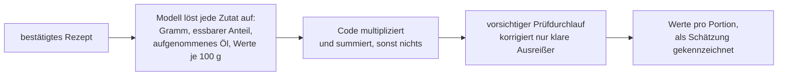
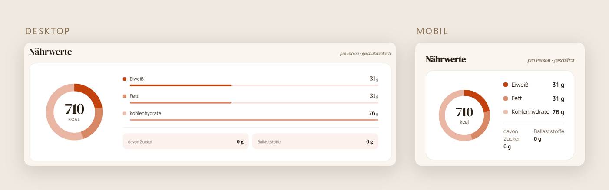
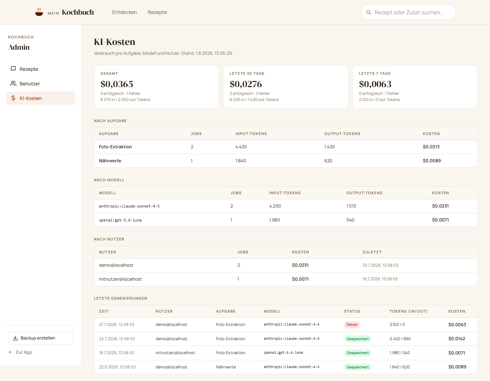

# Case Study: kochbuch-v3

_Stand August 2026. Die Bilder stammen aus dem Demo-Repo, die Rezepte darin sind Beispieldaten._

---

**Was:** Eine Rezept-App für mich, Freunde und Familie. Foto einer Kochbuchseite rein, strukturiertes Rezept raus, mit Zutaten, Schritten, Kategorien und geschätzten Nährwerten, als PWA auf dem iOS-Homescreen.
**Status:** Läuft seit Mai 2026. Ich benutze sie fast täglich, dazu kommen ungefähr drei bis fünf regelmäßige Nutzer. Zugang nur auf Einladung.
**Stack:** Go-Backend mit PostgreSQL und Caddy per docker-compose auf dem eigenen Server, Frontend Next.js mit React auf Vercel.
**Code:** github.com/mrlmueller/kochbuch-v3-demo

## Das Problem

Rezepte sammeln sich als Handyfotos, Screenshots und Links an. In der Form sind sie weder durchsuchbar noch sortierbar, und beim Kochen sind sie unpraktisch und schwer zu finden. Ich wollte alle Rezepte, die ich gut finde, an einem Ort haben, in einem einheitlichen Format. Dann habe ich beim Kochen schnellen Zugriff, kann durchscrollen, wenn ich Inspiration brauche, und kann den Einkaufszettel direkt anhand der Zutatenliste schreiben.

Die heutige App ist die dritte Version dieser Idee, und die beiden Vorgänger gehören zur Geschichte dazu, weil in ihnen die meisten Entscheidungen gefallen sind.

| Version | Zeitraum                | Was es war                                | Werkzeug                                      | Ausgang                     |
| ------- | ----------------------- | ----------------------------------------- | --------------------------------------------- | --------------------------- |
| v1      | Juli 2025               | PDF-Generator für ein gedrucktes Kochbuch | ChatGPT im Browser                            | nach vier Tagen eingestellt |
| v2      | Aug. 2025 bis Apr. 2026 | Website mit Druckausgabe                  | Browser-ChatGPT, dann Codex, dann Claude Code | von v3 abgelöst             |
| v3      | seit Mai 2026           | Neubau mit Go-Backend                     | Claude Code                                   | läuft in Betrieb            |

## Version 1: der PDF-Generator

Der erste Anlauf sollte gar keine App werden, sondern ein gedrucktes Kochbuch. Ein Python-Skript sollte aus HTML-Templates PDF-Seiten bauen, zum Ausdrucken und Laminieren für die Küche. Die PDF-Erstellung hat aber nie richtig funktioniert, und nach vier Tagen habe ich den Anlauf eingestellt. Gearbeitet habe ich damals mit ChatGPT im Browser, also Code generieren lassen, ins Projekt kopieren, testen, den Fehler zurückerklären und die nächste Fassung wieder übernehmen.

## Version 2: die Website mit Druckausgabe

Der zweite Anlauf wurde eine Website mit Next.js, FastAPI und Firebase, und dort hat der Druck-Gedanke dann tatsächlich funktioniert, mit einem Umweg, der rückblickend die eleganteste Idee von v2 war: Die Website selbst war die Layout-Maschine. Ein Skript öffnet jede Rezeptseite per Playwright, exportiert sie als DIN-A5-Karte in ein PDF und baut zusätzlich ein A4-Querformat mit zwei Karten pro Blatt und gepunkteter Schnittlinie. Eine Zeit lang zeigten die Seiten sogar Lochmarkierungen fürs Abheften an. Und jedes Rezept trug einen Druck-Hash, damit das System erkennt, welche Rezepte sich seit dem letzten Druck geändert haben und neu gedruckt gehören.

Ich habe dann wirklich einmal alle Rezepte gedruckt, laminiert und abgeheftet. Benutzt habe ich das fertige Buch aber nie weil ich es einfach unpraktisch fand. Am Bildschirm war jedes Rezept schneller gefunden, und die A5-Seite begrenzte den Platz für Zutaten und Zubereitung, was manche Rezepte ungenau machte. Die Website dagegen wurde mein fast tägliches Rezeptbuch, und weil Freunde Zugriff wollten, bekam sie Accounts.

Zwei Dinge liefen in v2 trotzdem schief. Nutzer konnten keine eigenen Rezepte anlegen, das blieb Admin-Sache. Und ich habe den Fokus verloren: Statt das Kochbuch zu verbessern, habe ich ein überdimensioniertes Admin-Dashboard gebaut, mit Statistiken über das Nutzerverhalten und genauer Kontrolle der Sessions. Die Zeit wäre im Produkt besser aufgehoben gewesen. Daneben gab es noch eine dritte, ehrgeizigere Baustelle, die gescheiterte Nährwert-Pipeline. Sie hat ein eigenes Kapitel weiter unten, weil ihre Fortsetzung in v3 zeigt, was ich daraus gelernt habe.

Auch die Werkzeuge haben sich in der v2-Zeit gedreht. Am Anfang habe ich noch viel mit ChatGPT im Browser gearbeitet, dann eine Zeit lang mit OpenAI Codex als erstem Coding-Agenten, aus einem einfachen Grund, ich musste nichts mehr aus dem Browser kopieren. Von dort bin ich zu Claude Code gewechselt und dabei geblieben, weil es schlicht das bessere Werkzeug war.

## Version 3: der Neubau

Anfang Mai 2026 habe ich neu angefangen, aus drei Gründen. Erstens war mir v2 mit der unnötigen Infrastruktur über den Kopf gewachsen. Zweitens wollte ich ein Go-Backend bauen, um an einer echten App zu sehen, ob Go hält, was andere Programmierer mir davon erzählt hatten, bevor ich die Sprache richtig lerne. Und drittens war ich mit dem alten Design unzufrieden und wollte ausprobieren, was mit den damals frischen Design-Werkzeugen von Claude möglich ist (Claude Design).

V3 ist komplett mit Claude Code entstanden, und zwar nach einem festen Muster: erst Spezifikation, dann Plan, dann Code. Ich beschreibe ausführlich, was ich an Features oder Änderungen haben will, der Agent entwirft daraus Spec und Plan und setzt sie um. An den Plänen ändere ich in der Regel wenig, weil meine Beschreibung das Scoping schon vorgibt, und offene Punkte lasse ich mir vorher als Fragen stellen. Im Repo liegen aus dieser Arbeit 17 datierte Dokumente, also Spezifikationen, Pläne mit insgesamt 426 einzelnen Checkbox-Schritten und Messberichte, jeweils entstanden, bevor der zugehörige Code geschrieben wurde. Der Kern der App stand so in der ersten Woche, vom 5. bis zum 11. Mai, mit 195 Commits, am ersten Tag die Design-Spezifikation und die Pläne für Backend und Frontend.

Wer die Spec vom ersten Tag liest, findet darin allerdings eine App ganz ohne Login. Das war kein Kurswechsel, Zugang auf Einladung war von Anfang an geplant. Ich habe nur bewusst erst die App fertig gebaut und den Auth danach davorgeschaltet, weil ich das Produkt in den Händen haben wollte, bevor ich das Drumherum baue. Ob das die beste Arbeitsweise ist, weiß ich nicht, für mich war es damals die logischste, weil ich ersteinmal das neue Go Backend ausprobieren wollte bevor ich eine komplette App baue.

Beim Interface lohnt sich eine ehrliche Trennung. Das UI, also das Aussehen, kam zu geschätzt 95 % aus Claude Design. Das war kein One-Shot, ich habe natürlich noch viel nachjustieren müssen, aber im Großen und Ganzen hat das Werkzeug das ohne große Probleme gut hinbekommen. Das UX dagegen, also wie sich die App beim Benutzen verhält, habe ich selbst erarbeitet, denn das können Agenten nach meiner Erfahrung bis heute nicht gut. Sie können die App nicht selbst in die Hand nehmen und benutzen, und genau da entsteht gutes UX. Meine Methode dafür war unspektakulär: Ich nutze die App fast täglich und bin sehr kritisch gegenüber jedem User Interface, Kleinigkeiten, die mich stören, notiere ich mir und bringe sie in Ordnung. Dazu habe ich die App jedem in die Hand gedrückt, der auch nur ein bisschen Interesse gezeigt hat, und einfach zugeschaut, wie er navigiert, ohne etwas zu erklären.

Mitte Mai wurde es ruhig im Repo, und der Grund ist unspektakulär: Es gab nichts zu verändern, ich war zufrieden, die App lief im Alltag. Anfang Juni folgte dann der zweite große Schub, der Nährwert-Teil.

## Nährwerte, zweiter Anlauf: erst messen, dann bauen

Die Vorgeschichte spielt in v2 und ist mein bestes Beispiel dafür, wie KI einen in die falsche Richtung führen kann. Ich wollte damals aus jedem Rezept die exakten Nährwerte bestimmen, nicht nur Kalorien und Protein, sondern auch Vitamine, Eisen und alles, was der Körper sonst braucht. Insgesamt waren es um die 15 Nährwerte. Darauf sollte ein Algorithmus aufsetzen, der aus meinem Essen der letzten Tage ableitet, was ich heute kochen sollte. Auf dem Gebiet hatte ich fast kein Vorwissen, also habe ich im Dialog mit dem LLM ausgelotet, wie machbar das ist, und das LLM hat mir in LLM-Manier versichert, dass wir das hinbekommen. Dass man auf solche Zusagen nicht viel geben kann, wusste ich schon damals, aber versuchen wollte ich es trotzdem. Die passenden Nährwert-APIs zu finden war noch recht unkompliziert. Eine Pipeline aber, in der ein Agent die richtigen Lebensmittel anfragt, das passende Ergebnis auswählt und dann noch erkennt, wie eine Zutat beim Kochen verwendet wird, hatte immer einen großen Fehler drin. Und genau da lag das Problem: Mir fehlte das Fachwissen, um zu erkennen, ob ich vor einem lösbaren Problem stehe oder längst in einer Sackgasse. Beim Empfehlungs-Algorithmus dasselbe, ich habe wissenschaftliche Papers gesammelt und an das damalige Claude Code gegeben, in der Hoffnung, dass daraus ein fundiertes Modell wird. Die Datenlage, die ich so geschaffen habe, war bestenfalls dünn, und die Aufgabe war schlicht zu hoch gegriffen. Ehrlicherweise würde das auch das heutige Fable 5 ohne einen Menschen mit echtem Fachwissen wahrscheinlich nicht schaffen. Von dieser Arbeit ist übrigens wenig übrig, sie lief größtenteils uncommittet und ist verloren gegangen, es gibt also nur noch die Erinnerung und ein paar Reste im Code.

Die Lehre habe ich mitgenommen: Ein komplexes Ergebnis bekommt man mit KI nur, wenn man selbst genug im Bilde ist, um das Modell anzuleiten und zu merken, wenn es falsch abbiegt.

In v3 wollte ich die Nährwerte trotzdem wieder, stark vereinfacht auf kcal, Protein, Fett und Ballaststoffe, und diesmal andersherum: erst messen, dann bauen. Bevor eine Zeile Produktionscode entstand, habe ich von Hand ein Referenzset aus 14 eigenen Rezepten durchgerechnet, das später auf 29 wuchs, und dazu ein zweites, unabhängiges Set aus 15 Rezepten einer fremden Rezept-App übernommen, deren Nährwerte nicht von mir stammen. Gegen diese Sets liefen neun durchnummerierte Experimente, vom naiven Modell-Prompt bis zu verschiedenen Arbeitsteilungen zwischen Modell und Code. Alles davon liegt im Repo unter `backend/cmd/nutrition-eval/`, die Messberichte unter `docs/superpowers/research/`.

| Experiment | Ansatz                                                         | kcal-Fehler (MAPE) | innerhalb ±20 % |
| ---------- | -------------------------------------------------------------- | -----------------: | --------------: |
| 1          | Modell direkt nach Nährwerten fragen                           |             21,6 % |            50 % |
| 2          | plus Begründungsschritt (Chain-of-Thought)                     |             16,0 % |            71 % |
| 3          | plus Zubereitungsschritte als Kontext                          |             15,1 % |            79 % |
| 5          | Gramm-Tabellen und Koch-Umrechnungen im Code                   |             14,8 % |            86 % |
| 8          | Modell liefert je Zutat Gramm und Nährwerte, Code summiert nur |             10,7 % |            79 % |
| 9          | plus zweiter, vorsichtiger Prüfdurchlauf                       |              8,7 % |            86 % |

Das Wichtigste an dieser Tabelle steht zwischen den Zeilen: Mein Zwischenergebnis wurde von der eigenen Messung gekippt. Nach Experiment 5 hielt ich die Sache für entschieden, der Bericht von damals nennt die deterministische Architektur wörtlich „validated". Erst das erweiterte Set und die unabhängigen Fremdrezepte zeigten, dass deren Bausteine auf breiterer Datenlage verlieren. Die festen Stück-Tabellen rechneten bei „40 Stück" Teigblätter mit einem 100-Gramm-Standardwert und kamen auf vier Kilo Teig. Die Datenbank-Suche ignorierte Angaben wie „fettarm" und griff zur Vollfett-Variante, beim fettarmen Mozzarella lag sie damit 134 % daneben. Und die Koch-Umrechnungen im Code rechneten doppelt, sobald das Modell das Kochen schon eingepreist hatte. Am Ende gewann fast das Gegenteil des Zwischenstands: Das Modell übernimmt die komplette Koch-Logik und liefert je Zutat Gramm und Nährwerte, der Code multipliziert und summiert nur noch. So bleibt jede Zutat einzeln nachprüfbar, und die Arithmetik macht keine Modell-Fehler mehr.

Die Messung fand nebenbei einen Fehler, den ich durch Draufschauen nie gefunden hätte: Beim Schnitzel zählte das Modell das komplette Frittier-Öl als Zutat und lag damit 543 % über dem Referenzwert. Seitdem steht im Prompt und im Code die Regel, dass Badöl nie eine Zutat ist und nur die aufgenommene Menge zählt. Ganz genau werden die Werte trotzdem nie, weil geschätzte Mengenangaben eine Grenze setzen, 500 g Kartoffeln funktionieren deutlich besser als 5 Kartoffeln. Deshalb steht im UI bei jedem Wert „geschätzt" dabei, und ein Admin muss ein Rezept erst als geprüft markieren, bevor überhaupt gerechnet wird. Die ganze Messreihe hat API-Kosten von rund zehn Dollar gebraucht.

## Entscheidungen und ihre Gründe

**Go, mit ehrlicher Einordnung.** Die App läuft auf einem Go-Backend, und sie ist schnell. Go kann ich trotzdem noch nicht richtig und lerne es gerade. Genau dafür war das Projekt gedacht: erst an einer funktionierenden App sehen, ob sich die Sprache lohnt, dann lernen.

**Self-Hosting statt Cloud.** Das empfohlene Setup für Go war eine SQL-Datenbank, und die hätte auf einer Cloud-Plattform um die 20 Euro im Monat gekostet. Für ein Projekt ohne Einnahmen, das nur ich und eine Handvoll Leute nutzen, ist mir das zu viel, also laufen Backend und Datenbank auf meinem eigenen Server bei mir Zuhause, nur das Frontend liegt auf Vercel. Da die App nicht öffentlich zugänglich ist, kommt der Server auch nie an seine Grenzen.

**Eine Session pro Nutzer.** Ein normales Konto kann nur auf einem Gerät gleichzeitig angemeldet sein, eine neue Anmeldung wirft das alte Gerät raus. So lohnt es sich nicht, Anmeldedaten weiterzugeben, und ich behalte die Kontrolle darüber, wer Zugriff auf die App hat. Die Anmeldung selbst läuft zwar über Firebase, aber nur für die Frage, wer jemand ist. Ob die Person hereindarf und wie lange, entscheidet das Backend mit eigenen Sessions in der eigenen Datenbank.

**Ein Admin-Bereich in der richtigen Größe.** Die App wird von mir betrieben, nicht von einem Anbieter, also musste alles, was sonst ein Dashboard beim Dienstleister wäre, mitgebaut werden: Nutzer einladen und deaktivieren, Tageslimits anheben, Modelle pro Auftrag wählen und vor allem die KI-Kosten im Blick behalten, aufgeschlüsselt nach Aufgabe, Modell und Nutzer. In v2 war das Admin-Dashboard mein Fokusverlust. In v3 ist es bewusst auf das beschränkt, was der Betrieb wirklich braucht, und diesmal hat es die Größe behalten.

## Ergebnis und Stand heute

Jeder, dem ich die App bis jetzt in die Hand gegeben habe, konnte alles alleine und ohne Erklärung bedienen. Das hatte ich vorher noch nie. Man muss dazu sagen, dass es eine überschaubare App ist. Aber mit dem UI und UX bin ich sehr zufrieden, und ich habe seit dem Launch mehrfach versucht, die Oberfläche mit neuen Werkzeugen noch einmal neu zu bauen. Nichts davon hat mich so überzeugt, dass ich die jetzige Version ersetzt hätte.

Die App läuft seit Mai 2026 in Betrieb. Jeden Sonntag sichert ein automatisches Backup alle Rezepte als lesbares JSON in ein privates Repository, Rezepte gehen also nicht verloren. Das Backend hat 56 Testfunktionen mit Schwerpunkt auf Autorisierung und Missbrauchsgrenzen.

## Belege

- Repo `mrlmueller/kochbuch-v3-demo`, Stand Juli 2026, mit der Commit-Historie ab Mai 2026 (297 Commits), README, Screenshots und den 17 Spezifikations-, Plan- und Messdokumenten unter `docs/superpowers/`.
- Nährwert-Experimente: `backend/cmd/nutrition-eval/` mit neun Experiment-Skripten, den Referenzsets und den Messberichten in `docs/superpowers/research/`.
- Vorgeschichte aus den privaten Arbeits-Repos: v1 vier Commit-Tage im Juli 2025, v2 154 Commits von August 2025 bis April 2026, dort auch die Druckausgabe samt Druck-Hash.
