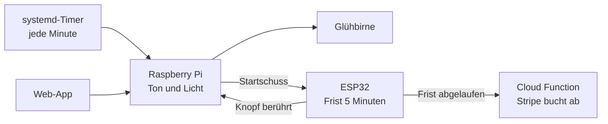
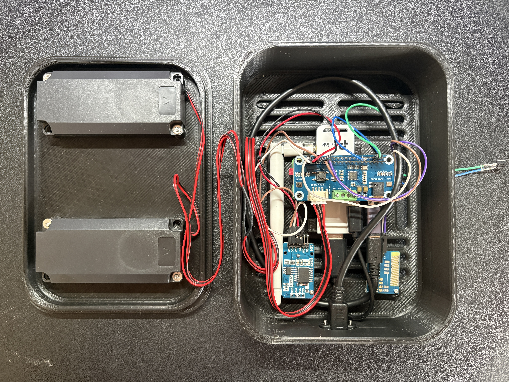
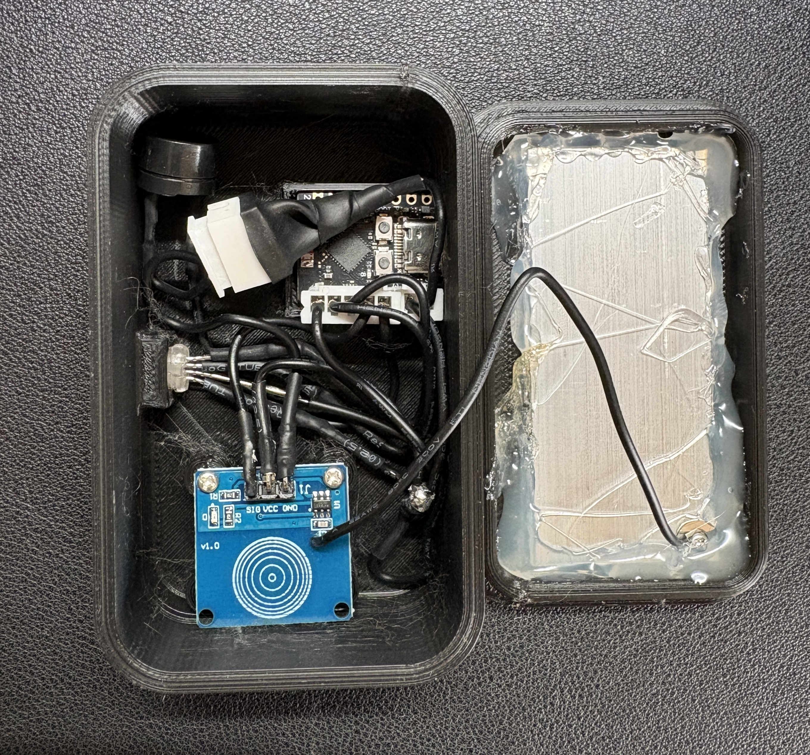
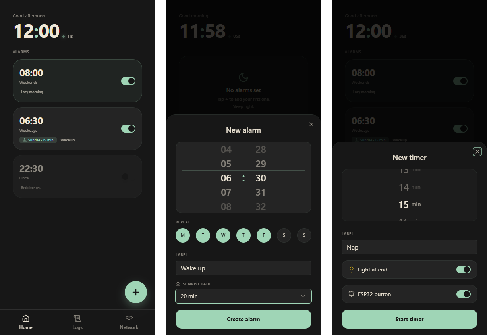

# Case Study: strafwecker

_Stand August 2026. Die Gerätefotos sind echt, die beiden Außenaufnahmen per KI retuschiert (Hand, Staub und lose Kabel entfernt), die App-Ansichten stammen aus der Oberfläche im Mock-Modus._

---

**Was:** Ein Wecker, der Geld kostet, wenn man liegen bleibt. Ein Raspberry Pi im Schlafzimmer klingelt, ein ESP32 im Nebenraum startet gleichzeitig eine Frist von fünf Minuten, und wird sein Knopf nicht rechtzeitig berührt, löst er über eine Cloud Function eine Abbuchung per Stripe aus. Dazu eine Web-App fürs Handy für Weckzeiten, Nap-Timer und den Verlauf.
**Status:** Läuft seit Anfang 2025, jeden Morgen, nur bei mir. Seit ungefähr sieben Monaten ohne einen einzigen Ausfall.
**Stack:** Raspberry Pi Zero 2 W mit FastAPI, SQLite und systemd-Timern, ESP32 mit MicroPython, Tuya-Glühbirne über tinytuya, Cloud Function auf GCP mit Stripe, Frontend Next.js auf Vercel.
**Code:** github.com/mrlmueller/strafwecker-v2-demo

## Das Problem

Ich hatte morgens manchmal ein Problem mit dem Aufstehen und habe gern noch ein zweites oder drittes Mal auf Snooze gedrückt. Mein Studium lief online, also gab es auch keinen äußeren Grund, zu einer bestimmten Zeit aus dem Bett zu sein. Die Idee dazu habe ich in einem Buch gelesen und fand sie interessant genug, um sie auszuprobieren: ein Wecker, der einen mit einem kleinen finanziellen Verlust dazu zwingt aufzustehen. Die Strafe war von Anfang an geplant, sie ist der Grund, warum es das Projekt gibt.

Das Entscheidende an der Umsetzung ist, dass man den Wecker nicht vom Bett aus ausschalten kann. Der Pi macht nur den Ton und das Licht, mit der Strafe hat er nichts zu tun. Die kontrolliert allein der ESP32 im Nebenraum, und um ihn zu deaktivieren, muss man aufstehen, hingehen und die Touchfläche berühren. Den Pi auszustecken hilft nicht, es gibt keinen anderen Weg als den Knopf.

| Zeitraum                | Woran gearbeitet wurde                                                |
| ----------------------- | --------------------------------------------------------------------- |
| Januar bis Februar 2025 | Pi mit Flask-Backend, Cloud Function, Lampe, ESP32 mit Knopf, Web-App |
| März bis April 2025     | Netzwerk-Wächter mit automatischem Neustart, Netzwerk-Logging         |
| im Lauf von 2025        | Gehäuse, Touchfläche, Buzzer, WLAN-Adapter                            |
| Mai 2026                | Neubau des Backends, Nap-Timer, neue Oberfläche                       |
| Juli 2026               | Ursache des übereinandergelegten Wecktons gefunden                    |

## Wie ein Morgen abläuft

Ist für den Wecker ein Sonnenaufgang eingestellt, beginnt die Glühbirne 5 bis 30 Minuten vor der Weckzeit zu leuchten, zuerst bei minimaler Helligkeit von dunklem Rot nach warmem Gelb, dann in warmem Weiß bis zur vollen Helligkeit, in Minutenschritten, das Licht ändert sich also jede Minute ein bisschen. Hier habe ich versucht, einen Übergang zu erstellen, der aussieht wie ein Sonnenaufgang. Zur Weckzeit spielt der Pi den Ton, schaltet das Licht voll an und benachrichtigt den ESP32. Der startet seine Frist und zeigt den Zustand über eine LED: Cyan heißt warten, Grün heißt rechtzeitig berührt, Rot heißt Frist verpasst. Rechtzeitig berührt meldet der ESP32 das an den Pi, und der Ton stoppt. Läuft die Frist ab, ruft der ESP32 selbst die Cloud Function auf, und die Strafe wird gebucht. Der Ton am Pi stoppt nach zehn Minuten von allein, und am Pi sitzt auch ein eigener Knopf für den Ton, aber beides ändert an der Strafe nichts, denn die läuft allein über den ESP32.

Neben Weckern gibt es Nap-Timer für den Mittagsschlaf. Nach der eingestellten Zeit geht das Licht direkt voll an, ohne Fade, und auch hier lässt sich der ESP32-Knopf optional zuschalten, damit der Mittagsschlaf nicht zum Nachmittagsschlaf wird.

## Die Hardware

Vor diesem Projekt hatte ich noch nie einen Lötkolben in der Hand und keine Ahnung von Elektronik, und ich würde auch heute nicht sagen, dass ich wirklich welche habe. Ich habe für den Pi und für den ESP32 so lange probiert, bis es funktioniert hat, und es dann genau so zusammengelötet. Deshalb sieht es innen so aus, wie es aussieht.

Der Pi ist ein Zero 2 W mit einem Audio-HAT und den zwei Lautsprechern, die beim HAT dabei waren. Auch das war schon ein Umweg. Zuerst hatte ich nur einen Audio-Chip gekauft, der versprach, dass man einen Lautsprecher anschließen kann, und den habe ich nie zum Laufen gebracht. Irgendwann habe ich aufgegeben und einen fertigen HAT gekauft, um mir die Kopfschmerzen zu ersparen. Das Gehäuse habe ich in Fusion 360 entworfen. Gelernt ist dafür ein zu großes Wort, ich habe mir ein paar Videos angesehen und dann so lange herumprobiert, bis etwas dabei herauskam, das für meinen Zweck taugte. Gedruckt habe ich es auf einem Ender 3 V2, den mir ein Freund geschenkt hat, und auch damit musste ich erst umgehen lernen. Perfekte Druckqualität habe ich nie erreicht, für diesen Zweck reicht es aber aus.

Im Gehäuse steckt mehr, als der Wecker braucht, und jedes Teil hat eine Geschichte. Der TP-Link-WLAN-Adapter unter dem Pi ist die Antwort auf das Problem, das mich am längsten beschäftigt hat: Der Pi hat seine WLAN-Verbindung verloren und ohne Neustart nicht wiedergefunden. Erst mit einem WLAN-Verstärker und diesem Adapter läuft es stabil. Die Echtzeituhr DS3231 war meine Idee, damit der Wecker unabhängig vom Internet immer genau weiß, wie spät es ist. Am Ende ist sie völliger Overkill und hat wahrscheinlich keinen realen Mehrwert, aber sie ist drin und schadet nicht. Und das Funkmodul daneben tut gar nichts. Die Idee dahinter war ein kabelloser ESP32 mit Batterie. Der ESP32 hat einen Deep-Sleep-Modus, in dem der Prozessor, der größte Teil des Speichers, WLAN und Bluetooth abgeschaltet sind und nur der kleine RTC-Teil des Chips weiterläuft. Aufwecken lässt er sich dann über seinen eigenen Timer oder über ein Signal an einem bestimmten Pin. Mein Plan war, dass der Pi per Funkimpuls genau dieses Signal auslöst, so dass der ESP32 nur zur Weckzeit wach ist und nach meiner Rechnung monatelang mit einer Ladung ausgekommen wäre. Ich habe es nie zum Laufen bekommen, der ESP32 hängt schlussendlich doch am Kabel.

Der Knopf am ESP32 war zuerst ein nackter Taster, so wie ihn der Pi bis heute hat. Jetzt ist es eine Aluminiumplatte auf einem kapazitiven Touch-Sensor, im 3D-gedruckten Gehäuse mit Magneten unter der Schreibtischplatte im Nebenraum befestigt. Den Taster am Pi würde ich gern auch noch austauschen, aber das hieße, ein neues Gehäuse zu entwerfen und zu drucken, und darin sehe ich gerade keinen Mehrwert. Es funktioniert so, wie es ist, der Rest wäre Fine-Tuning.

## Die Software, erste Fassung

Die erste Fassung ist komplett mit ChatGPT im Browser entstanden, auch die Einrichtung des Pi lief nach dessen Anleitung. Das war teilweise eine frustrierende Erfahrung, weil vieles von dem, was ChatGPT behauptet hat, schlicht nicht funktioniert hat, gerade bei Hardware und Pi-Konfiguration. Ich musste sehr viel selbst probieren und testen. Später habe ich Claude für den Code genommen und ihm eine SSH-Verbindung auf den Pi eingerichtet, damit er direkt dort arbeiten kann. Aber der Großteil der Arbeit am Pi und am ESP32 ist mit ChatGPT im Browser entstanden, Claude Code hat am Ende fast nur noch den Feinschliff gemacht. Den Entwurf und die Entscheidungen habe ich gemacht, den Code hat die KI geschrieben, und wie viel Handarbeit trotzdem darin steckt, zeigt das Innere der beiden Gehäuse.

Die Architektur von damals steht im Kern bis heute. Auf dem Pi läuft ein Backend mit SQLite, und ein systemd-Timer startet jede Minute ein Skript, das prüft, ob ein Wecker fällig ist, und die Lampe für den Sonnenaufgang stellt. Das Prinzip dahinter war meine Idee: Das Skript merkt sich nichts, sondern rechnet jede Minute aus „jetzt" und „nächster Wecker" neu aus, wie hell und in welcher Farbe die Lampe gerade sein muss, und schickt genau einen Befehl. Ein abgestürzter Dienst oder ein Neustart kann den Sonnenaufgang so nicht verlieren, die nächste Minute rechnet einfach wieder von vorn. Der ESP32 bekommt vom Pi nur den Startschuss mit Weck- und Log-Kennung, alles Weitere entscheidet er selbst, und die Cloud Function kennt nur ihn.

Im Frühjahr 2025 kam der Netzwerk-Wächter dazu, weil der Pi immer wieder die WLAN-Verbindung verlor. Er prüft per Ping, ob das Netz da ist, und startet den Pi sonst neu, heute alle fünf Minuten aus einem eigenen Timer. Damit das nicht zur Unzeit passiert, schaut er vorher nach, ob gerade ein Wecker klingelt oder in den nächsten sieben Minuten fällig ist, und nach zwei Neustarts in einer halben Stunde hört er auf, um keine Schleife zu bauen. Dazu kam ein minütliches Logging von Signalstärke, Temperatur und Erreichbarkeit, das sich in der App ansehen lässt. Gebraucht habe ich das, um überhaupt zu verstehen, wann und warum die Verbindung wegbrach.

## Der Neubau im Mai 2026

Nach gut einem Jahr war der Code so gewachsen, wie er entstanden war: per SSH auf dem Pi editiert, ohne Deployment über Git. Ich wollte mit Claude Code einmal über das Ganze drübergehen, weil ich sicher war, dass vieles nicht optimal war. Außerdem wollte ich das Backend von Flask auf FastAPI umstellen, weil die Oberfläche an einigen Stellen recht langsam an ihre Daten vom Pi kam.

Der Neubau dauerte drei Tage, vom 9. bis zum 11. Mai, nach demselben Muster wie bei meinen anderen Projekten: erst eine Spezifikation, dann Pläne mit einzelnen Schritten, dann Code. Die Spezifikation vom ersten Tag listet 16 Fehler der alten Fassung auf, darunter einen, den ich bis dahin nur als Symptom kannte. Das Flask-Backend lief unter gunicorn mit zwei Workern, und jeder Worker hatte sein eigenes „Wecker aktiv"-Flag. Je nachdem, welcher Worker eine Anfrage bekam, sah er einen laufenden Wecker oder nicht. Im Alltag hat mich das nur insofern getroffen, dass der Weckton manchmal doppelt übereinander lief, nervig, aber keine Einschränkung. Die neue Fassung läuft als ein einzelner Prozess, mit drei Schichten aus Routen, Services und Datenzugriff, mit Alembic-Migrationen statt `CREATE TABLE IF NOT EXISTS` im Code, mit einer Konfiguration, die den Start verweigert, wenn ein Wert fehlt, und mit einem Deployment über einen GitHub-Runner auf dem Pi selbst: Push auf main, Tests laufen, Migrationen laufen, Dienst startet neu. Der erste der drei Pläne beginnt mit einem vollständigen Abbild der SD-Karte, bevor irgendetwas angefasst wird.

An einer Stelle lief der Neubau in die falsche Richtung. Claude Code hat den Sonnenaufgang durch eine eigene Konstruktion ersetzt, einen Hintergrund-Task im API-Prozess, der die Lampe in Schritten hochfährt. Das hat schlicht nicht funktioniert, hier sind Coding-Agenten einfach limitiert, weil sie schlicht nicht die Möglichkeit haben zu sehen, ob das Licht wirklich angeht oder nicht. Ich habe es wieder so bauen lassen wie vorher, minütlich neu berechnen, und dann lief es sofort wieder. Die Spezifikation dazu vom 10. Mai benennt die Fehler der Zwischenlösung selbst: Ein Neustart der API mitten im Fade hätte ihn verloren, ein Wecker, der zehn Minuten vor dem Klingeln mit dreißig Minuten Fade gestellt wird, wäre gar nicht erst gestartet.

Am zweiten Tag kamen die Nap-Timer und die neue Oberfläche dazu, eine dunkle Palette fürs Nachttischlicht, Wheel-Picker für die Uhrzeit, Bottom-Tab-Leiste, als PWA auf dem iPhone-Homescreen. Am dritten Tag fiel auf, dass das Netzwerk-Logging beim Neubau verloren gegangen war, und es kam zurück, zusammen mit einer täglichen Aufräumroutine für die Datenbank.

Ganz fertig war es damit nicht. Der Weckton klang weiterhin manchmal etwas seltsam, aber auch hier wurde die Ursache gefunden und in Ordnung gebracht. Der Ton lief als Endlosschleife innerhalb des API-Prozesses, und jedes Mal, wenn der Dienst neu startete, etwa nach einem Deployment, begann eine zweite Schleife, die niemand mehr stoppen konnte, weil der neue Prozess nichts von der alten wusste. Die Töne haben sich über Tage gestapelt. Seitdem läuft der Ton in einem eigenen Unterprozess, und vor jedem Klingeln werden alle noch laufenden Player beendet, über eine PID-Datei und einen Scan der laufenden Prozesse.

## Entscheidungen und ihre Gründe

**Die Abbuchung läuft außerhalb der Wohnung.** Der ESP32 bucht nicht selbst ab, er ruft eine Cloud Function auf GCP auf, und erst die spricht mit Stripe. Ich wollte keinen Code, der Geld von meiner Karte abbuchen kann, auf einem ESP32 in meinem Zuhause laufen lassen. Ein konkretes Sicherheitsproblem konnte ich nicht benennen, es hat sich damals einfach falsch angefühlt. Nebenbei ist die Strafe dadurch austauschbar: Der ESP32 kennt nur eine Adresse, die er aufruft, und man könnte ohne viel Umbau alles Mögliche als Strafe dahinterlegen.

**Der Pi darf nichts über die Strafe wissen.** Die Frist läuft auf dem ESP32, und nur er ruft die Cloud Function. So kann kein Fehler am Pi, kein Ausstecken und kein Knopf am Bett die Strafe verhindern. Umgekehrt ist der Pi seit dem Neubau darauf ausgelegt, dass ein Fehlalarm Geld kostet: Das minütliche Skript prüft, ob derselbe Wecker in den letzten zweieinhalb Minuten schon ausgelöst wurde, bevor es den ESP32 ein zweites Mal startet.

**Jede Minute neu rechnen statt Zustand halten.** Das gilt für den Sonnenaufgang und für den Wecker selbst. Das Skript fragt jede Minute, was jetzt zu tun ist, und hält nichts im Speicher. Was beim Neubau wegrationalisiert wurde und zurückkommen musste, hat mich in dieser Entscheidung bestätigt.

**Zugang ohne Login.** Die App ist nur für mich. Sie ist über einen Token erreichbar, der einmal per Link gesetzt wird und dann als Cookie bleibt, sonst nur von festgelegten IP-Adressen aus.

## Ergebnis und Stand heute

Der Wecker tut, wofür er gebaut ist. Ich stelle ihn auf eine Uhrzeit, und spätestens vier Minuten nach dem Klingeln stehe ich auf, ohne Ausnahme. Die Strafe begann bei 50 Cent, und meine Regel für mich ist, dass sie sich bei jedem Liegenbleiben verdoppelt. Heute steht sie bei zwei Euro, zweimal bin ich also liegen geblieben. Perfekt ist das System nicht. An Tagen, an denen ich vergessen hatte, den Wecker auszuschalten, weil ich im Urlaub war, hat er trotzdem abgebucht. Das ist bei dem Betrag kein Problem, und der Wecker war dann für die nächsten Tage aus, da ich ihn von unterwegs ausschalten kann.

Am Anfang gab es so viele Probleme, dass ich mehrfach überlegt habe, das Projekt aufzugeben, vor allem wegen des WLANs und weil der ESP32 manchmal nicht erreichbar war. Letzteres hat den Zweck nie verfehlt, denn gemerkt habe ich es immer erst, als ich schon vor dem Knopf stand, und da war ich ja dann schon aufgestanden. Seit dem WLAN-Adapter läuft der Wecker seit ungefähr sieben Monaten ohne einen einzigen Ausfall.

## Belege

- Repo `mrlmueller/strafwecker-v2-demo`, Stand Juli 2026, veröffentlicht als Momentaufnahme aus einem privaten Repository mit 102 Commits (100 davon vom 9. bis 11. Mai 2026, zwei vom 13. Juli 2026), README mit Fotos und Ablaufdiagramm.
- Erste Fassung in zwei privaten Repos: Pi-Code ab 28.01.2025 (51 Commits, Flask, `wecker.py` mit minütlicher Sonnenaufgangs-Berechnung, `network_reboot.py`) und Web-App ab 31.01.2025 (26 Commits).
- Spezifikationen und Pläne unter `docs/superpowers/`: Architekturentwurf mit der Fehlerliste der alten Fassung (09.05.2026), Sonnenaufgang-Rückbau, Nap-Timer und UI-Neubau (10.05.2026), sechs Dokumente mit 302 einzelnen Schritten.
- Minütliche Prüfung: `backend/wecker.py`, Sonnenaufgang als reine Funktion in `backend/app/services/light_service.py`, ESP32-Anbindung in `backend/app/api/v1/esp.py`, Tonwiedergabe als Unterprozess in `backend/app/services/player_service.py` und `backend/app/audio_player.py`.
- Firmware: `esp32/main.py` (Frist, LED, Aufruf der Cloud Function, Watchdog).
- 132 Tests (126 Backend, 6 Firmware-Logik), Deployment-Workflow `.github/workflows/backend-deploy.yml`. Der Code der Cloud Function liegt nicht im Repository.
